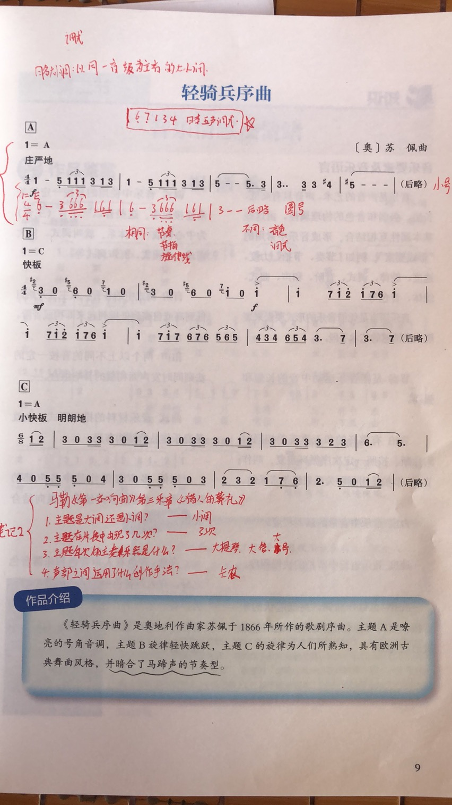

# 2021.09.27


18点交地理笔记还用说吗.webp


## 音乐

* [x] 笔记

要将音乐笔记写在课本上\(page,9\)

## 语文

> 预习新课完成作业

* [x] 单独的作业引用

~~反正原话是这样，什么意思我也不知道。~~

> 9.27语文作业:预习《心有一团火,温暖众人心》，完成下列问题:
>
> 1.概括文章写了张秉贵的哪些事，分别表现了他的什么品质，从中可以看出张秉贵是一个什么样的人?提示:一共是8件事情，概括人物要用张秉贵是...\(身份\)
>
> 2.文章在描写张秉贵的时候，选择了很多细节，试找出来，并分析其作用。
>
> 3.找出文中写“一团火”的句子，分析文章的行文线索和结构特点，并说说文章为什么用《心有一团火，温暖众人心》作为标题。
>
> 4.文章为什么以一位路过北京的青年农民的诗歌结尾?

## 数学

* [x] 课本\(page,39：1、2、3\)
* [x] 优化设计小本\(page,13,10题可选\)

## 英语

* [x] 文档一份



### 提示

明天本作业的订正将作为考勤。

星期三将听写词汇表第七页。

## 化学

* [ ] 文档一份



**无需提交。**好欸。

## 物理

* [x] 物理实验册，P1-5。
* [x] 课本课后作业\(第二章第3节\)
* [x] 顶尖第3节
* [x] 抄写6个公式\(5遍\)

$$
\begin{aligned}a=\dfrac{v_{t}-v_{0}}{t}\\
v_{t}=v_{0}+at\\
t=\dfrac{v_{t}-v_{0}}{a}\end{aligned}\\
\begin{aligned}s=\dfrac{1}{2}\left( v_{0}+v_{t}\right) t\\
s=v_{0}t+\dfrac{1}{2}at^{2}\\
v_{t}^{2}-v_{0}^{2}=2as\end{aligned}
$$

> 顶尖，18页，下方，概念，要记一记。

