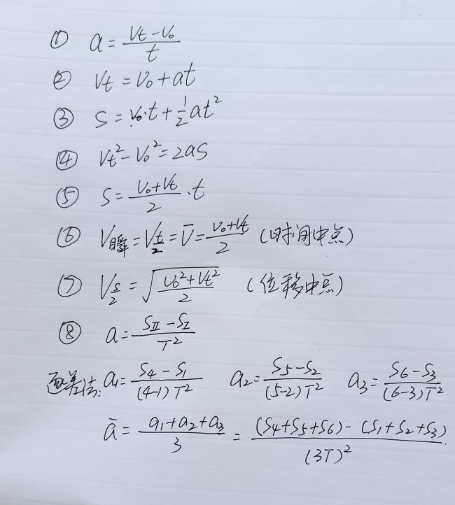

# 2021.09.29

## 语文

* [ ] 探索者



* [ ] 订正 心有一团火

好心人发一下文档谢谢。

## 数学

* [ ] 课本\(基本不等式,例1例2\)
* [ ] 课本\(page,46：练习1～5\)
* [x] ~~幻灯片题目~~  19:30 要考一张集合的试卷\(允许提前开始完成3,6题不算,必须提交\)

## 英语

* [ ] 文档一份



## 物理

* [ ] 课本\(page,53~54\)
* [ ] 练习册\(2.4节\)
* [ ] 抄写公式

$$
\begin{aligned}a=\dfrac{v_{t}-v_{0}}{t}\\
v_{t}=v_{0}+at\\
\end{aligned}\\
\begin{aligned}s=\dfrac{1}{2}\left( v_{0}+v_{t}\right) t\\
s=v_{0}t+\dfrac{1}{2}at^{2}\\
v_{t}^{2}-v_{0}^{2}=2as\end{aligned}\\
V_{instant}=V_\dfrac{t}{2}=\overline{V}=\dfrac{V_{0}+V_{t}}{2}\left( Midpoint of time\right) \\
$$

这什么啊，我讨厌写 `LaTeX`，自己去看物理群去。

> 2021.10.16 由于特别原因，补一张图。

> 练习册大本小本都要写。
>
> 有红笔订正，计算分析过程。
>
> 最晚 2021.10.02 晚上前提交。

## 化学

* [ ] 文档一份



> **无需提交。**好欸。

## 地理

* [x] 名校学案\(page,34~37\)

> 今天晚上 22 点前要求提交。

## 其他

[历史](https://yuioto.gitbook.io/homework/zuo-ye-dan/2021.09.28#li-shi)和[政治](https://yuioto.gitbook.io/homework/zuo-ye-dan/2021.09.28#zheng-zhi)需要在今天 22 点前提交。

其他作业还有[生物](https://yuioto.gitbook.io/homework/zuo-ye-dan/2021.09.28#sheng-wu)作业\(没有明确提交时间，完成范围\)
