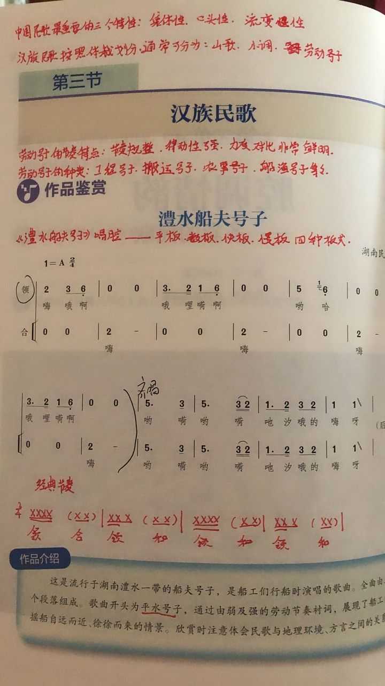

# 2021.10.13

英语、历史、地理、数学需要在今天完成或提交。

## 地理

- [ ] 名校学案(page,43~45)
- [ ] 表格

列表对比海水温度、盐度和密度分布规律、影响因素

|                          | 温度         | 盐度 | 密度 |
| ------------------------ | ------------ | ---- | ---- |
| 分布规律                 | 水平（纬度） |      |      |
| 垂直                     |              | —    |      |
| 时间                     |              | —    | —    |
| 影响因素（并注明相关性） |              |      |      |

> 需要在晚上22点前提交。

## 语文

- [ ] 优化设计(第七课)
- [ ] 核对《归圆田居》

> 需要在 2021.10.14：17:59:00 前提交。

## 数学

- [ ] 优化设计(page,36,探究一)
- [ ] 幻灯片习题

> 阅读课本P60给出的4个实例，讨论下列问题:
>
> 1. 以上四个实例存在哪些变量?
> 2. 变量的变化范围分别是什么?
> 3. 对于每个变化范围内的变量，它们之间有什么关系?
> 4. 两个变量之间存在着怎样的对应关系?
> 5. 你能从集合与对应的观点说出函数的概念吗?
>
- [ ] ppt总结笔记抄在书本或画出来，请详细！

> 需要在 2021.10.14：09:00:00 前提交。

## 英语

- [ ] 文档一份

> If you are one of the lucky ones who can go to a senior high school,  you should be grateful for the opportunity. So the next time you do not want to do boring, difficult homework or go to class, think about the children who don’t have the chance to get a good education.

[1013英语作业.docx](../.gitbook/assets/1013作业.docx)

英语他什么时候发参考答案啊啊啊！

> 9:30 开始订正。

## 化学

- [ ] 文档一份

[校本作业9.docx](../.gitbook/assets/校本作业9.docx)

> **无需提交**好欸！

## 音乐

- [ ] 作笔记

